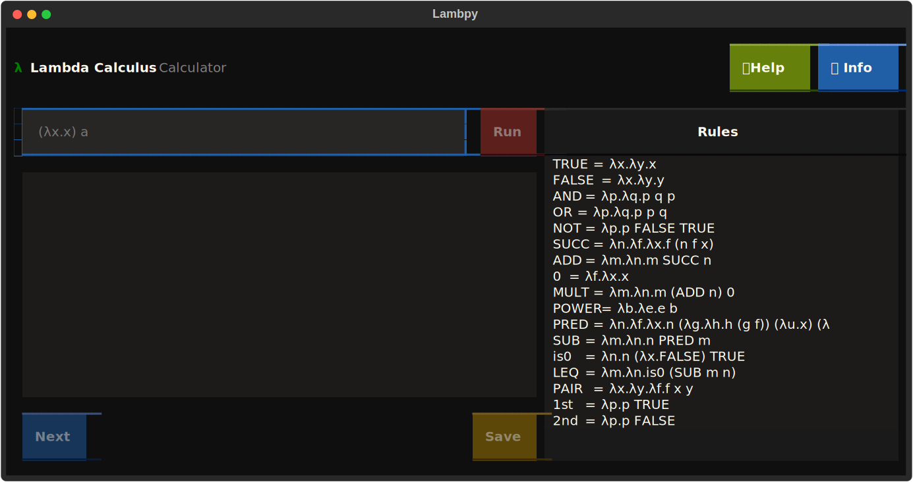
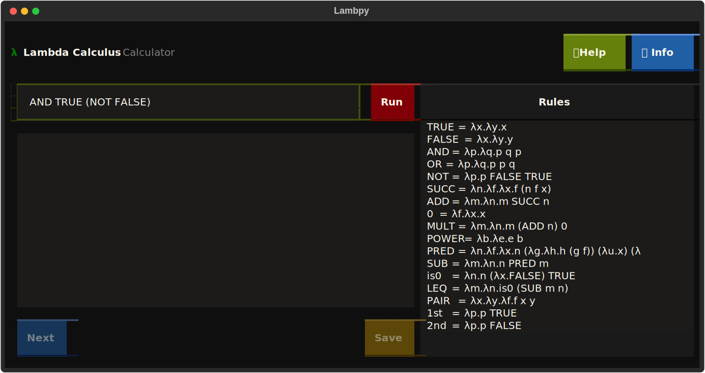
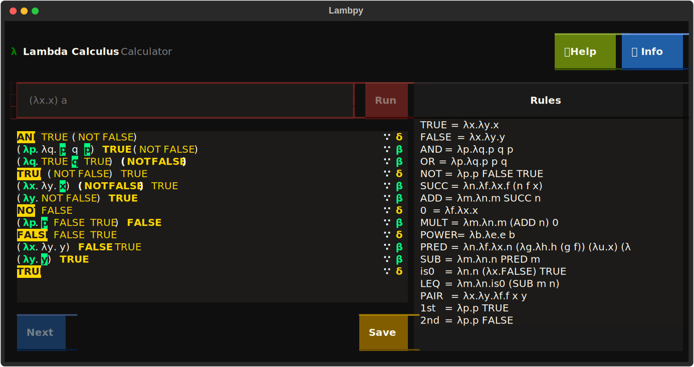

# Lambpy

Lambpy is a Lambda Calculus interpreter implemented in Python, designed to
provide an interactive experience for writing and executing lambda
expressions, with some quality of life features.

## Screenshots







## Acknowledgements

 - [Lambda Calculus Calculator](https://lambdacalc.io/)
 - [Textual](https://textual.textualize.io/)


## Features

- syntax highlighting,
- rewrite rules,
- load rules from an input file

The program can be executed either on a terminal console or browser page.


## Installation


### Pre-compiled

Just download the
[latest](https://github.com/ehoefel/lambpy/releases/tag/v1.0-beta)
Lambpy release.

### Manual compilation

1. First, clone the repository

```
git clone https://github.com/ehoefel/lambpy.git
cd lambpy
```
2. It is recommended to create a virtual environment, as you'll need to install
   some package dependencies

```
python -m venv
source venv/bin/activate
```

3. Install the python dependencies

```
pip install -r requirements.txt
```

4. Execute with the following command
```
python src/lambpy/lambpy.py
```

5. To leave the virtual environment, use the following command

```
deactivate
```


## Roadmap

- Implement functionality for Help and Info buttons
- Be able to select and execute specific parts of the expression
- Add UI button shortcuts (Save)
- Improve button style
- Improve visualization of long rules
- Test on different operating systems, terminal emulators, and screen sizes
- Improve code quality, remove unecessary code, improve maintenability
- Allow editing / removal of rules
- Implement user settings
- Implement error highlighting on user input token
- Implement error messages
- Improve performance

