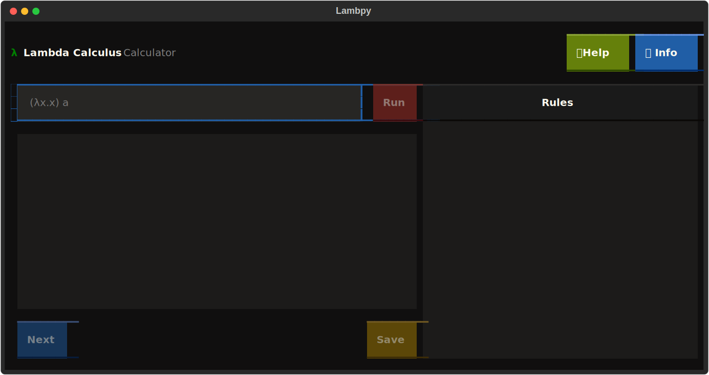
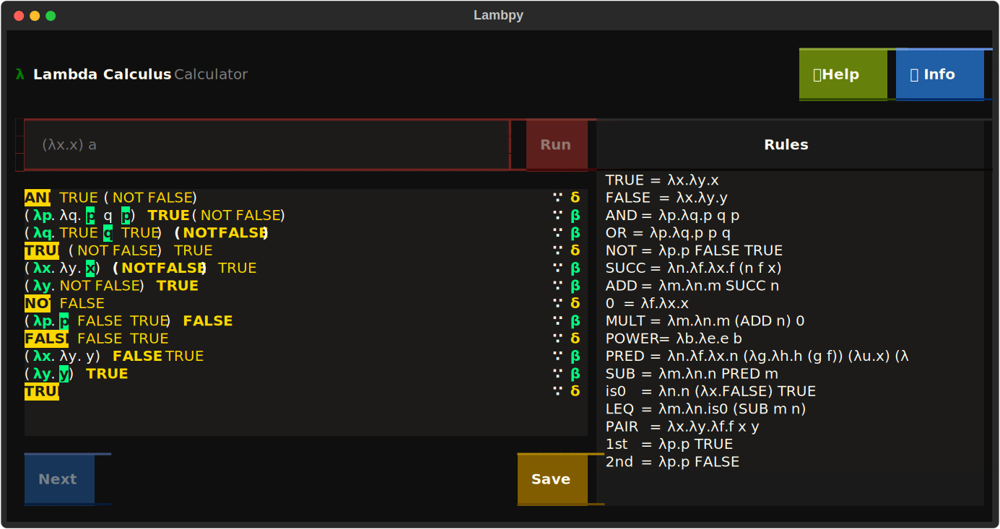

# Lambpy

lambpy is a Lambda Calculus interpreter implemented in Python, designed to provide an interactive experience for writing and executing lambda expressions, with some QoL features.

## Screenshots

## Acknowledgements

 - [Lambda Calculus Calculator](https://lambdacalc.io/)
 - [Textual](https://textual.textualize.io/)

## Features

- syntax highlighting,
- rewrite rules,
- load and save rules.

The program can be executed either on a terminal console or browser page.

## Installation

Download the zip file of the project

## Roadmap

- Implement functionality for Help and Info buttons
- Be able to select and execute specific parts of the expression
- Add UI button shortcuts (Save)
- Improve button style
- Improve visualization of long rules
- Test on different operating systems, terminal emulators, and screen sizes
- Improve code quality, remove unecessary code, improve maintenability
- Allow editing / removal of rules
- Implement user settings
- Implement error highlighting on user input token
- Implement error messages
- Improve performance

